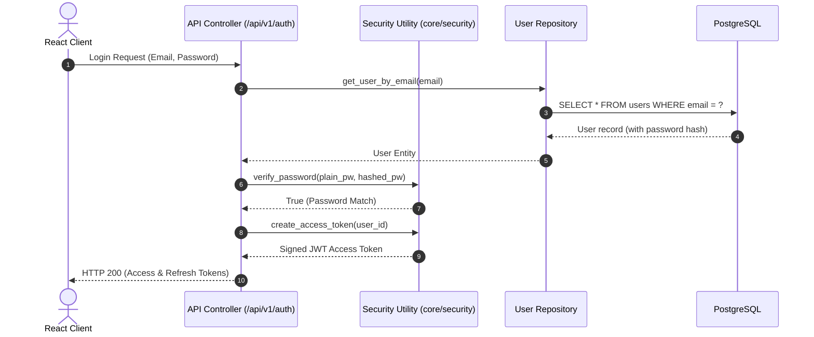
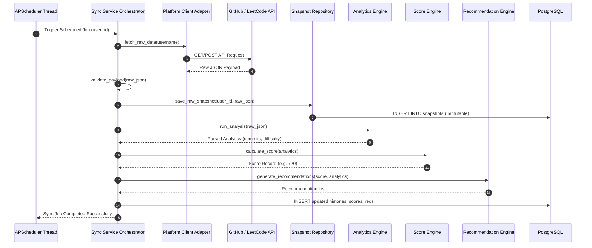
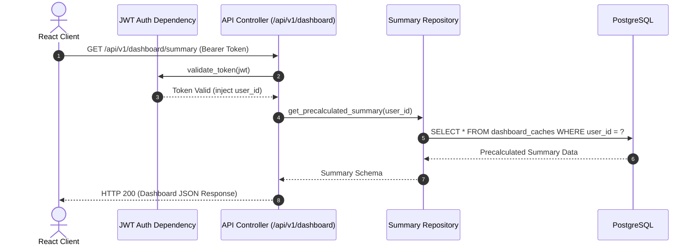
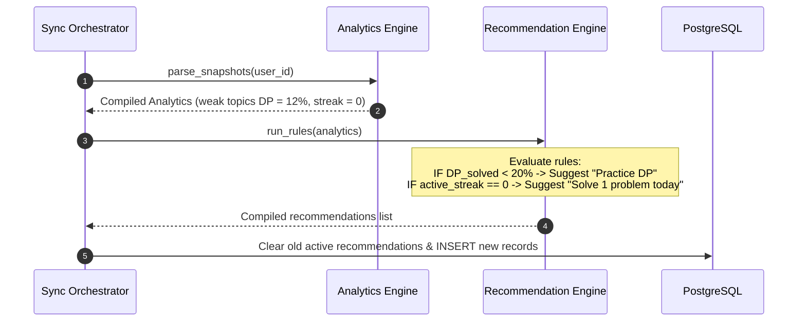

# System Architecture Specification
**Version:** 1.0.0  
**Status:** Approved  
**Prepared By:** Rachana Gandla  

This document describes the architectural patterns, component interactions, data flows, and design principles governing the DevTrack system.

---

## 1. Architectural Style: Layered Architecture

DevTrack follows a clean, decoupled **Layered Architecture** with strict Separation of Concerns (SoC). Each layer communicates only with the layer directly beneath it.

```
       +---------------------------------------------+
       |             Lightweight React Client        |
       +----------------------|----------------------+
                              | HTTP REST APIs (/api/v1/...)
                              v
+-------------------------------------------------------------+
| 1. API Controller Layer (app/api/)                          |
|    - Endpoint Routing                                       |
|    - Pydantic Validation & Serialization                    |
|    - JWT Authentication Checking                            |
+------------------------------|------------------------------+
                               v
+-------------------------------------------------------------+
| 2. Service Layer (app/services/)                            |
|    - Transactional Core Business Logic                      |
|    - Score calculations, Recommendation and Insights compilation|
|    - Platform integrations (outgoing httpx calls)           |
+------------------------------|------------------------------+
                               v
+-------------------------------------------------------------+
| 3. Repository Layer (app/repositories/)                    |
|    - Encapsulates SQLAlchemy CRUD syntax                    |
|    - Enforces lock-free relational queries                  |
+------------------------------|------------------------------+
                               v
+-------------------------------------------------------------+
| 4. Database Layer (PostgreSQL)                              |
|    - Structured tables, compound indexes, JSONB logs        |
+-------------------------------------------------------------+
```

---

## 2. Component Design & Module Responsibilities

### 2.1 The API Controller Layer (`app/api/`)
*   Exposes endpoints under the versioned path `/api/v1/...` (e.g., `/api/v1/auth/login`, `/api/v1/dashboard/summary`).
*   Runs validation schemas on request body payloads before parsing to services.
*   Converts database entities into clean output schemas, ensuring fields like password hashes are filtered out.

### 2.2 The Service Layer (`app/services/`)
*   The orchestrator of all business operations.
*   Contains sub-modules:
    *   `integrations/`: Handles outgoing network requests to external APIs (GitHub, LeetCode).
    *   `analytics/`: Parses raw data and identifies streaks or topic distribution ratios.
    *   `scoring/`: Implements the weighted formulas of the custom Developer Score.
    *   `insights/`: Computes change deltas and compiles observations.
    *   `recommendations/`: Converts identified weaknesses into target study actions.
    *   `scheduler/`: Runs out-of-band APScheduler triggers.

### 2.3 The Repository Layer (`app/repositories/`)
*   **Decoupling Policy:** Database transactions and query logic (SQLAlchemy session syntax) are confined strictly to repository modules.
*   **Persistence Focus:** Repositories *only* perform basic persistence operations (Insert, Update, Select, Delete). They contain zero business rules, score algorithms, or external network requests.
*   Services depend on repositories to read/write state, keeping the service logic independent of the SQL dialect.

---

## 3. Data Lifecycle & Pipeline Flow

The DevTrack data ingestion pipeline operates sequentially, taking raw third-party records and converting them into user insights:

```
[GitHub / LeetCode APIs]
          │
          ▼
[Validation Layer] (Ensures payload schema is not empty or malformed)
          │
          ▼
[Store Snapshot] (Saves raw response in database JSONB table)
          │
          ▼
[Run Analytics Engine] (Analyzers parse snapshot into language/difficulty metrics)
          │
          ▼
[Recalculate Developer Score] (Score Engine computes numerical scores out of 1000)
          │
          ▼
[Generate Insights] (Insights Engine compares analytics against past records)
          │
          ▼
[Generate Recommendations] (Recommendation Engine compiles actionable tips)
          │
          ▼
[Refresh Cache Tables] (Writes pre-aggregated metrics to read-optimized tables)
          │
          ▼
[Dashboard APIs] (Serves data instantly to frontend via HTTP GET `/api/v1/...`)
```

### 3.1 Historical Snapshot Immutability
*   Raw snapshots (`github_snapshots`, `leetcode_snapshots`) are **immutable log records**. Once saved to the database, they are never updated or overwritten.
*   **Rationale:**
    1.  **Historical Integrity:** Prevents data revisionism. If a user deletes a public repository or alters their LeetCode profile later, DevTrack preserves their historical growth records accurately.
    2.  **Auditability:** Makes debugging background parsing issues straightforward. If an analyzer parser bug occurs, developers can re-run the updated analytics engine over historical raw JSON payloads without re-fetching data from external servers.
    3.  **Analytics Base:** Allows developers to calculate rolling time-series trends (like streaks) without running complex database migrations on transactional states.

---

## 4. Read/Write Separation (Decoupling)

To maintain a target API latency of under 200ms, the read paths and write paths of the system are completely separated:
*   **Write Path (Ingestion):** Slow third-party requests and scoring calculations happen asynchronously in background scheduler tasks. They append data to the database without impacting user web requests.
*   **Read Path (Queries):** The API router endpoints (GET `/api/v1/...`) perform read-only select queries from pre-calculated cache tables. They never invoke third-party APIs or execute complex on-the-fly scoring loops during user requests.

---

## 5. Extension Points (Platform Adapters)

To support future platforms like Codeforces or HackerRank without altering the core scheduling or dashboard controllers, integrations are built using the **Adapter Pattern**:
*   The system defines an abstract base class `BasePlatformClient` inside `app/services/integrations/base.py`.
*   All third-party modules must inherit from this class and implement the `fetch_raw_data()` method.
*   The background worker schedules loops through registered subclass clients, making adding a new platform as simple as writing a single class file.

---

## 6. Sequence Diagrams

### 6.1 User Login (`POST /api/v1/auth/login`)


### 6.2 Background Synchronization Workflow


### 6.3 Dashboard Request (`GET /api/v1/dashboard/summary`)


### 6.4 Recommendation Generation Flow

