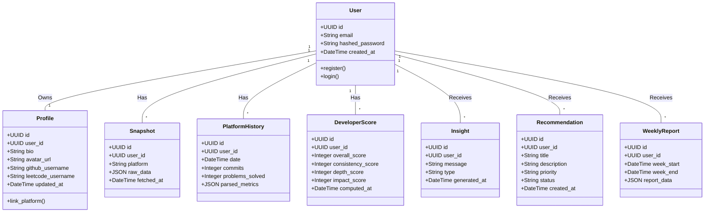

# Domain Model Specification
**Version:** 1.0.0  
**Status:** Approved  
**Prepared By:** Rachana Gandla  

This document describes the core domain entities, their responsibilities, relationships, and boundaries in the DevTrack system.

---

## 1. Domain Class Diagram (Mermaid)

---

## 2. Entity Descriptions & Responsibilities

### 2.1 User (Aggregate Root)
*   **Description:** Represents the authenticated identity in the system.
*   **Responsibilities:** Enforces login validation, registration invariants, password hashes, and identity lookup.
*   **Ownership:** Top-level entity. Owns all subsequent data generated in the workspace.

### 2.2 Profile
*   **Description:** Contains user profile metadata and linked platform username handles.
*   **Responsibilities:** Links platform handles (GitHub, LeetCode), checks syntax rules, and stores user biography details.
*   **Ownership:** Owned 1-to-1 by `User`.

### 2.3 Snapshot (Immutable log)
*   **Description:** The raw data payload fetched from GitHub or LeetCode during a sync cycle.
*   **Responsibilities:** Preserves an exact, unparsed backup of the third-party response.
*   **Ownership:** Owned 1-to-many by `User`. A snapshot is never modified after it is created.

### 2.4 PlatformHistory
*   **Description:** Tabular, parsed historical metrics derived from Snapshots.
*   **Responsibilities:** Extracts parameters (e.g. commits count, problems solved by difficulty) into structured relational columns to support query performance for chart endpoints.
*   **Ownership:** Owned 1-to-many by `User`. Created automatically by the Analytics Engine.

### 2.5 DeveloperScore
*   **Description:** The computed score (0-1000) and sub-category breakdowns.
*   **Responsibilities:** Stores overall score, category weights (consistency, depth, impact), and trends for a specific sync point.
*   **Ownership:** Owned 1-to-many by `User`.

### 2.6 Insight
*   **Description:** Text observation indicating deviations or trends in developer performance.
*   **Responsibilities:** Tracks metrics (e.g. drop in DP questions solved) and represents positive/negative warnings for dashboard feeds.
*   **Ownership:** Owned 1-to-many by `User`.

### 2.7 Recommendation
*   **Description:** Actionable task suggestion targeted at enhancing the developer's skills.
*   **Responsibilities:** Stores recommendation title, details, priority scale (High, Medium, Low), and completion status (Active, Dismissed, Completed).
*   **Ownership:** Owned 1-to-many by `User`.

### 2.8 WeeklyReport
*   **Description:** Relational summaries of user performance over a 7-day period.
*   **Responsibilities:** Computes weekly change logs (growth, consistency metrics) and preserves weekly performance archives.
*   **Ownership:** Owned 1-to-many by `User`. Generated at the end of each week.
