# Database Design Specification

**Version:** 1.0.0  
**Status:** Approved  
**Prepared By:** Rachana Gandla

This document describes the schema design, entity relationship model, constraints, indexing strategies, and architectural patterns of the PostgreSQL database for the DevTrack platform.

---

## 1. Database Overview
DevTrack uses **PostgreSQL** as its primary relational database. PostgreSQL was selected for:
*   **Asynchronous Concurrency (MVCC)**: Support for lock-free read operations from cached API endpoints while write operations (background ingestion syncs) are executing.
*   **JSONB Support**: High-performance semi-structured storage for backing up raw external JSON API payloads.
*   **Transactional Integrity (ACID)**: Strong transactional safety for user profiles and security management.

---

## 2. Entity Relationship Diagram (ERD)

The following diagram illustrates the relationships between the database tables:

```mermaid
erDiagram
    users ||--|| profiles : "owns (1:1)"
    users ||--o{ github_snapshots : "has (1:N)"
    users ||--o{ leetcode_snapshots : "has (1:N)"
    users ||--o{ github_histories : "has (1:N)"
    users ||--o{ leetcode_histories : "has (1:N)"
    users ||--o{ developer_scores : "receives (1:N)"
    users ||--o{ insights : "receives (1:N)"
    users ||--o{ recommendations : "receives (1:N)"
    users ||--o{ weekly_reports : "receives (1:N)"
    users ||--o{ sync_jobs : "executes (1:N)"
    users ||--o{ timeline_events : "achieves (1:N)"
    users ||--o{ milestones : "earns (1:N)"

    users {
        uuid id PK
        varchar email UK "Not Null"
        varchar hashed_password "Not Null"
        timestamptz created_at "Not Null"
        timestamptz updated_at "Not Null"
    }

    profiles {
        uuid id PK
        uuid user_id FK, UK "Not Null"
        text bio "Nullable"
        varchar avatar_url "Nullable"
        varchar github_username "Nullable"
        varchar leetcode_username "Nullable"
        timestamptz created_at "Not Null"
        timestamptz updated_at "Not Null"
    }

    github_snapshots {
        uuid id PK
        uuid user_id FK "Not Null"
        jsonb raw_data "Not Null"
        timestamptz fetched_at "Not Null"
    }

    leetcode_snapshots {
        uuid id PK
        uuid user_id FK "Not Null"
        jsonb raw_data "Not Null"
        timestamptz fetched_at "Not Null"
    }

    github_histories {
        uuid id PK
        uuid user_id FK "Not Null"
        date date "Not Null"
        integer commits "Not Null"
        integer stars "Not Null"
        integer forks "Not Null"
        integer repositories "Not Null"
        jsonb parsed_metrics "Not Null"
        timestamptz created_at "Not Null"
    }

    leetcode_histories {
        uuid id PK
        uuid user_id FK "Not Null"
        date date "Not Null"
        integer problems_solved "Not Null"
        integer easy_solved "Not Null"
        integer medium_solved "Not Null"
        integer hard_solved "Not Null"
        jsonb parsed_metrics "Not Null"
        timestamptz created_at "Not Null"
    }

    developer_scores {
        uuid id PK
        uuid user_id FK "Not Null"
        integer overall_score "Not Null"
        integer consistency_score "Not Null"
        integer depth_score "Not Null"
        integer impact_score "Not Null"
        timestamptz computed_at "Not Null"
    }

    insights {
        uuid id PK
        uuid user_id FK "Not Null"
        text message "Not Null"
        varchar type "Not Null"
        timestamptz generated_at "Not Null"
    }

    recommendations {
        uuid id PK
        uuid user_id FK "Not Null"
        varchar title "Not Null"
        text description "Not Null"
        varchar priority "Not Null"
        varchar status "Not Null"
        timestamptz created_at "Not Null"
        timestamptz updated_at "Not Null"
    }

    weekly_reports {
        uuid id PK
        uuid user_id FK "Not Null"
        date week_start "Not Null"
        date week_end "Not Null"
        jsonb report_data "Not Null"
        timestamptz created_at "Not Null"
    }

    sync_jobs {
        uuid id PK
        uuid user_id FK "Not Null"
        varchar status "Not Null"
        timestamptz started_at "Not Null"
        timestamptz completed_at "Nullable"
        integer duration_seconds "Nullable"
        text error_details "Nullable"
        varchar github_status "Nullable"
        varchar leetcode_status "Nullable"
    }

    timeline_events {
        uuid id PK
        uuid user_id FK "Not Null"
        varchar event_type "Not Null"
        varchar title "Not Null"
        text description "Nullable"
        date event_date "Not Null"
        timestamptz created_at "Not Null"
    }

    milestones {
        uuid id PK
        uuid user_id FK "Not Null"
        varchar name "Not Null"
        text description "Nullable"
        varchar badge_url "Nullable"
        timestamptz achieved_at "Not Null"
    }
```



---

## 3. Detailed Table Specifications

### 3.1 `users` Table
Stores basic credentials and core identity metadata for authenticated users.

| Column Name | Data Type | Key | Constraints | Description |
| :--- | :--- | :--- | :--- | :--- |
| `id` | UUID | PK | DEFAULT gen_random_uuid() | Unique identifier. |
| `email` | VARCHAR(255) | UK | NOT NULL, UNIQUE | User email address. |
| `hashed_password` | VARCHAR(255) | | NOT NULL | Bcrypt-hashed password. |
| `created_at` | TIMESTAMPTZ | | NOT NULL, DEFAULT NOW() | Record creation timestamp. |
| `updated_at` | TIMESTAMPTZ | | NOT NULL, DEFAULT NOW() | Record update timestamp. |

*   **Design Rationale**: Kept highly compact. Authentication checks are isolated to sub-millisecond queries on `email`.

### 3.2 `profiles` Table
Stores linked handles and user bio attributes in a 1-to-1 relationship with the user account.

| Column Name | Data Type | Key | Constraints | Description |
| :--- | :--- | :--- | :--- | :--- |
| `id` | UUID | PK | DEFAULT gen_random_uuid() | Unique identifier. |
| `user_id` | UUID | FK | NOT NULL, UNIQUE, REFERENCES users(id) ON DELETE CASCADE | 1:1 user linkage. |
| `bio` | TEXT | | NULL | Brief user biography. |
| `avatar_url` | VARCHAR(1024) | | NULL | Profile image link. |
| `github_username` | VARCHAR(255) | | NULL | GitHub username. |
| `leetcode_username` | VARCHAR(255) | | NULL | LeetCode username. |
| `created_at` | TIMESTAMPTZ | | NOT NULL, DEFAULT NOW() | Profile creation timestamp. |
| `updated_at` | TIMESTAMPTZ | | NOT NULL, DEFAULT NOW() | Profile update timestamp. |

*   **Design Rationale**: Separation of Concerns: user credentials (mutable login factors) and profile descriptors are isolated into separate tables. This avoids lock contention on credentials during updates to username linkages.

### 3.3 `github_snapshots` Table
Immutable Daily raw responses from the GitHub API.

| Column Name | Data Type | Key | Constraints | Description |
| :--- | :--- | :--- | :--- | :--- |
| `id` | UUID | PK | DEFAULT gen_random_uuid() | Unique identifier. |
| `user_id` | UUID | FK | NOT NULL, REFERENCES users(id) ON DELETE CASCADE | Owner identification. |
| `raw_data` | JSONB | | NOT NULL | Unmodified API payload. |
| `fetched_at` | TIMESTAMPTZ | | NOT NULL, DEFAULT NOW() | Fetch completion timestamp. |

*   **Design Rationale**: Serves as the backup and audit source. Uses `JSONB` for optimized binary parsing and storage footprint.

### 3.4 `leetcode_snapshots` Table
Immutable Daily raw responses from the LeetCode GraphQL API.

| Column Name | Data Type | Key | Constraints | Description |
| :--- | :--- | :--- | :--- | :--- |
| `id` | UUID | PK | DEFAULT gen_random_uuid() | Unique identifier. |
| `user_id` | UUID | FK | NOT NULL, REFERENCES users(id) ON DELETE CASCADE | Owner identification. |
| `raw_data` | JSONB | | NOT NULL | Unmodified API payload. |
| `fetched_at` | TIMESTAMPTZ | | NOT NULL, DEFAULT NOW() | Fetch completion timestamp. |

*   **Design Rationale**: Mirrors the GitHub snapshot architecture to isolate API schema revisions.

### 3.5 `github_histories` Table
Daily parsed relational records representing commit totals and code volume.

| Column Name | Data Type | Key | Constraints | Description |
| :--- | :--- | :--- | :--- | :--- |
| `id` | UUID | PK | DEFAULT gen_random_uuid() | Unique identifier. |
| `user_id` | UUID | FK | NOT NULL, REFERENCES users(id) ON DELETE CASCADE | Owner identification. |
| `date` | DATE | | NOT NULL | Snapshot calendar date. |
| `commits` | INTEGER | | NOT NULL, DEFAULT 0, CHECK (commits >= 0) | Commits count for the date. |
| `stars` | INTEGER | | NOT NULL, DEFAULT 0, CHECK (stars >= 0) | Stars count for public repos. |
| `forks` | INTEGER | | NOT NULL, DEFAULT 0, CHECK (forks >= 0) | Forks count. |
| `repositories` | INTEGER | | NOT NULL, DEFAULT 0, CHECK (repositories >= 0) | Repository count. |
| `parsed_metrics` | JSONB | | NOT NULL | Structured parameters (languages, streaks). |
| `created_at` | TIMESTAMPTZ | | NOT NULL, DEFAULT NOW() | Ingestion timestamp. |

*   **Constraints**: Unique constraint on `(user_id, date)` to enforce a single history row per user per calendar day.
*   **Design Rationale**: Powers delta calculations and charts. Parsing metrics into distinct INTEGER columns enables rapid aggregation without querying heavy raw JSON blocks.

### 3.6 `leetcode_histories` Table
Daily parsed relational records representing problem counts and stats.

| Column Name | Data Type | Key | Constraints | Description |
| :--- | :--- | :--- | :--- | :--- |
| `id` | UUID | PK | DEFAULT gen_random_uuid() | Unique identifier. |
| `user_id` | UUID | FK | NOT NULL, REFERENCES users(id) ON DELETE CASCADE | Owner identification. |
| `date` | DATE | | NOT NULL | Snapshot calendar date. |
| `problems_solved` | INTEGER | | NOT NULL, DEFAULT 0, CHECK (problems_solved >= 0) | Total problems solved. |
| `easy_solved` | INTEGER | | NOT NULL, DEFAULT 0, CHECK (easy_solved >= 0) | Easy problems count. |
| `medium_solved` | INTEGER | | NOT NULL, DEFAULT 0, CHECK (medium_solved >= 0) | Medium problems count. |
| `hard_solved` | INTEGER | | NOT NULL, DEFAULT 0, CHECK (hard_solved >= 0) | Hard problems count. |
| `parsed_metrics` | JSONB | | NOT NULL | Topic distribution lists. |
| `created_at` | TIMESTAMPTZ | | NOT NULL, DEFAULT NOW() | Ingestion timestamp. |

*   **Constraints**: Unique constraint on `(user_id, date)` to prevent duplicate daily tracking.
*   **Design Rationale**: Provides structural metrics for the LeetCode dashboard queries.

### 3.7 `developer_scores` Table
Computed scoring snapshots for tracking developer progress over time.

| Column Name | Data Type | Key | Constraints | Description |
| :--- | :--- | :--- | :--- | :--- |
| `id` | UUID | PK | DEFAULT gen_random_uuid() | Unique identifier. |
| `user_id` | UUID | FK | NOT NULL, REFERENCES users(id) ON DELETE CASCADE | Target user. |
| `overall_score` | INTEGER | | NOT NULL, CHECK (overall_score BETWEEN 0 AND 1000) | Main aggregate score. |
| `consistency_score` | INTEGER | | NOT NULL, CHECK (consistency_score >= 0) | Consistency component score. |
| `depth_score` | INTEGER | | NOT NULL, CHECK (depth_score >= 0) | Depth component score. |
| `impact_score` | INTEGER | | NOT NULL, CHECK (impact_score >= 0) | Impact component score. |
| `computed_at` | TIMESTAMPTZ | | NOT NULL, DEFAULT NOW() | Scoring timestamp. |

*   **Design Rationale**: Separated from core histories to track overall scoring history independently. Allows rapid timeline score queries.

### 3.8 `insights` Table
List of text notifications describing user performance changes.

| Column Name | Data Type | Key | Constraints | Description |
| :--- | :--- | :--- | :--- | :--- |
| `id` | UUID | PK | DEFAULT gen_random_uuid() | Unique identifier. |
| `user_id` | UUID | FK | NOT NULL, REFERENCES users(id) ON DELETE CASCADE | Recipient user. |
| `message` | TEXT | | NOT NULL | Insight detail description. |
| `type` | VARCHAR(50) | | NOT NULL | Metric category flag (e.g. `leetcode_consistency`, `github_volume`). |
| `generated_at` | TIMESTAMPTZ | | NOT NULL, DEFAULT NOW() | Creation timestamp. |

*   **Design Rationale**: Feeds the dashboard insights component. The `type` column permits categorical grouping in frontend filters.

### 3.9 `recommendations` Table
Mutable action guidelines suggesting practice routes.

| Column Name | Data Type | Key | Constraints | Description |
| :--- | :--- | :--- | :--- | :--- |
| `id` | UUID | PK | DEFAULT gen_random_uuid() | Unique identifier. |
| `user_id` | UUID | FK | NOT NULL, REFERENCES users(id) ON DELETE CASCADE | Target user. |
| `title` | VARCHAR(255) | | NOT NULL | Short summary of recommendation. |
| `description` | TEXT | | NOT NULL | Explanatory text. |
| `priority` | VARCHAR(50) | | NOT NULL, CHECK (priority IN ('high', 'medium', 'low')) | Importance scale. |
| `status` | VARCHAR(50) | | NOT NULL, DEFAULT 'active', CHECK (status IN ('active', 'dismissed', 'completed')) | Current display state. |
| `created_at` | TIMESTAMPTZ | | NOT NULL, DEFAULT NOW() | Initial creation timestamp. |
| `updated_at` | TIMESTAMPTZ | | NOT NULL, DEFAULT NOW() | State transition timestamp. |

*   **Design Rationale**: Unlike immutable insights, recommendations have mutable states (`status` changes to 'completed' or 'dismissed') which users can toggle directly.

### 3.10 `weekly_reports` Table
Archived weekly retrospective activity evaluations.

| Column Name | Data Type | Key | Constraints | Description |
| :--- | :--- | :--- | :--- | :--- |
| `id` | UUID | PK | DEFAULT gen_random_uuid() | Unique identifier. |
| `user_id` | UUID | FK | NOT NULL, REFERENCES users(id) ON DELETE CASCADE | Recipient user. |
| `week_start` | DATE | | NOT NULL | Date starting the week (Monday). |
| `week_end` | DATE | | NOT NULL | Date ending the week (Sunday). |
| `report_data` | JSONB | | NOT NULL | Aggregated metrics and deltas. |
| `created_at` | TIMESTAMPTZ | | NOT NULL, DEFAULT NOW() | Report generation timestamp. |

*   **Constraints**: Unique constraint on `(user_id, week_start)` to avoid multiple report compilations for the same user-week.
*   **Design Rationale**: Precomputes complex multi-day analytics into a standalone archive, ensuring fast lookups of historical reports.

### 3.11 `sync_jobs` Table
Logs execution statuses and durations of the scheduler jobs.

| Column Name | Data Type | Key | Constraints | Description |
| :--- | :--- | :--- | :--- | :--- |
| `id` | UUID | PK | DEFAULT gen_random_uuid() | Unique identifier. |
| `user_id` | UUID | FK | NOT NULL, REFERENCES users(id) ON DELETE CASCADE | Executing user. |
| `status` | VARCHAR(50) | | NOT NULL, CHECK (status IN ('started', 'completed', 'failed', 'degraded')) | Core sync status. |
| `started_at` | TIMESTAMPTZ | | NOT NULL, DEFAULT NOW() | Sync start time. |
| `completed_at` | TIMESTAMPTZ | | NULL | Sync completion time. |
| `duration_seconds`| INTEGER | | NULL | Duration of job execution. |
| `error_details` | TEXT | | NULL | Raw exception error trace if failed. |
| `github_status` | VARCHAR(50) | | NULL, CHECK (github_status IN ('success', 'failed', 'rate_limited')) | GitHub run sub-status. |
| `leetcode_status` | VARCHAR(50) | | NULL, CHECK (leetcode_status IN ('success', 'failed', 'rate_limited')) | LeetCode run sub-status. |

*   **Design Rationale**: Critical for system observability. Exposes system health and rate limit occurrences.

### 3.12 `timeline_events` Table
Stores chronological progression logs for a user's development timeline.

| Column Name | Data Type | Key | Constraints | Description |
| :--- | :--- | :--- | :--- | :--- |
| `id` | UUID | PK | DEFAULT gen_random_uuid() | Unique identifier. |
| `user_id` | UUID | FK | NOT NULL, REFERENCES users(id) ON DELETE CASCADE | Target user. |
| `event_type` | VARCHAR(100) | | NOT NULL | Category (e.g. `account_linked`, `first_commit`). |
| `title` | VARCHAR(255) | | NOT NULL | High-level title. |
| `description` | TEXT | | NULL | Detailed event description. |
| `event_date` | DATE | | NOT NULL | Calendar date of occurrence. |
| `created_at` | TIMESTAMPTZ | | NOT NULL, DEFAULT NOW() | Ingestion timestamp. |

*   **Design Rationale**: Feeds the scrollable timeline UI without running expensive historical table scans on registration or repository creation fields.

### 3.13 `milestones` Table
Records achievement badges earned by the user.

| Column Name | Data Type | Key | Constraints | Description |
| :--- | :--- | :--- | :--- | :--- |
| `id` | UUID | PK | DEFAULT gen_random_uuid() | Unique identifier. |
| `user_id` | UUID | FK | NOT NULL, REFERENCES users(id) ON DELETE CASCADE | Achiever user. |
| `name` | VARCHAR(255) | | NOT NULL | Milestone moniker (e.g. "LeetCode Century"). |
| `description` | TEXT | | NULL | Achievement description. |
| `badge_url` | VARCHAR(1024) | | NULL | Badge image link. |
| `achieved_at` | TIMESTAMPTZ | | NOT NULL, DEFAULT NOW() | Ingestion timestamp. |

*   **Design Rationale**: Promotes user consistency. Keeps record of achievements distinct from raw performance indices.

---

## 4. Indexing Strategy

To guarantee that read requests from cached endpoints load immediately under any dataset size, we apply targeted database indexing (described in DDL notation):

```sql
-- Identity Unique Indexes
CREATE UNIQUE INDEX idx_users_email ON users(email);
CREATE UNIQUE INDEX idx_profiles_user_id ON profiles(user_id);

-- Snapshot Ingestion Query Optimization (Latest-fetch)
CREATE INDEX idx_github_snapshots_user_fetch ON github_snapshots(user_id, fetched_at DESC);
CREATE INDEX idx_leetcode_snapshots_user_fetch ON leetcode_snapshots(user_id, fetched_at DESC);

-- Historical Chart Range Queries
CREATE INDEX idx_github_histories_user_date ON github_histories(user_id, date DESC);
CREATE INDEX idx_leetcode_histories_user_date ON leetcode_histories(user_id, date DESC);

-- Score Progression Charts
CREATE INDEX idx_scores_user_date ON developer_scores(user_id, computed_at DESC);

-- Dashboard Scroll Container Feeds
CREATE INDEX idx_insights_user_date ON insights(user_id, generated_at DESC);
CREATE INDEX idx_recommendations_user_status ON recommendations(user_id, status);
CREATE INDEX idx_reports_user_date ON weekly_reports(user_id, week_start DESC);
CREATE INDEX idx_timeline_events_user_date ON timeline_events(user_id, event_date DESC);
CREATE INDEX idx_milestones_user_achieved ON milestones(user_id, achieved_at DESC);
```

---

## 5. Architectural & Design Decisions

### 5.1 Normalization vs. Denormalization Decisions
*   **3NF (Third Normal Form)** is strictly applied to core relational tables (`users`, `profiles`, `github_histories`, `leetcode_histories`, `developer_scores`, `recommendations`, `timeline_events`, `milestones`). This ensures data consistency, simplifies updates, and avoids insert/update anomalies.
*   **Denormalization** is intentionally used in `github_snapshots`, `leetcode_snapshots`, and `weekly_reports` using the `JSONB` format. This prevents over-normalization of highly nested third-party properties (like a list of 100 repositories with languages and creation timestamps) that would otherwise require complex multi-table joins.

### 5.2 Snapshot Strategy
Daily raw third-party payloads are saved as **immutable snapshots**. Snapshots are strictly append-only. 
*   *Correction/Pruning fallback*: If an ingestion parser bug is discovered, the historical snapshots remain untouched, enabling us to re-run the updated analytics parser over past raw JSON records.

### 5.3 Versioning Strategy
*   **Schema Versioning**: Managed using Alembic migrations tracking incremental schema changes via revision scripts in the `/alembic` folder.
*   **Data Versioning**: Daily structured histories are versioned using the `date` key. Old metrics are never updated; new snapshots are appended as fresh rows on subsequent calendar days.

### 5.4 Audit Fields
*   Every table includes audit creation fields (`created_at` or specific timestamps like `fetched_at`, `computed_at`, `started_at`).
*   Mutable tables (`users`, `profiles`, `recommendations`) include an `updated_at` column which is updated via database triggers or ORM listeners during modifications.

### 5.5 Soft Delete Strategy
*   **Decision**: Soft deletes are **not** implemented in this database layout. 
*   **Rationale**: To comply with data privacy policies (such as GDPR "Right to be Forgotten") and prevent bloating database storage with abandoned accounts, deleting a user account executes a `CASCADE DELETE` across all associated foreign key relationships (`profiles`, `histories`, `snapshots`, `scores`, `weekly_reports`).
